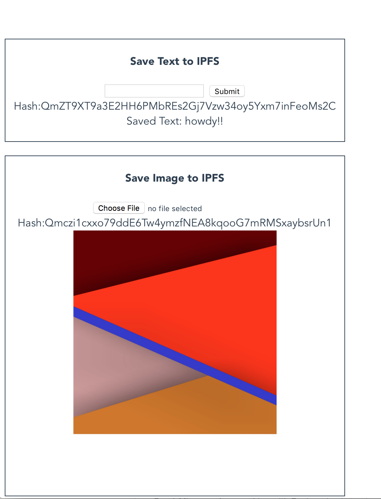

#### IPFS EOS Demo

This is a Vue.js example using IPFS to store images and text then storing the hash from IPFS as a string on the EOS blockchain.

This example shows:
- Saving text to IPFS, then storing the hash returned by IPFS on the EOS blockchain
- Saving an image to IPFS, then storing the hash returned by IPFS on the EOS blockchain
- fetching the hash from the EOS blockchain, then querying IPFS for the image or text





### Config

Create a file called secrets.js and add it to the config directory. Paste this into the file:

```
module.exports = {
    endpoint: "http://x.x.x.x:8888",
    keys: [
        'keygoeshere,
        'keygoeshere',
    ]
};
```

Start using: 

    npm run dev